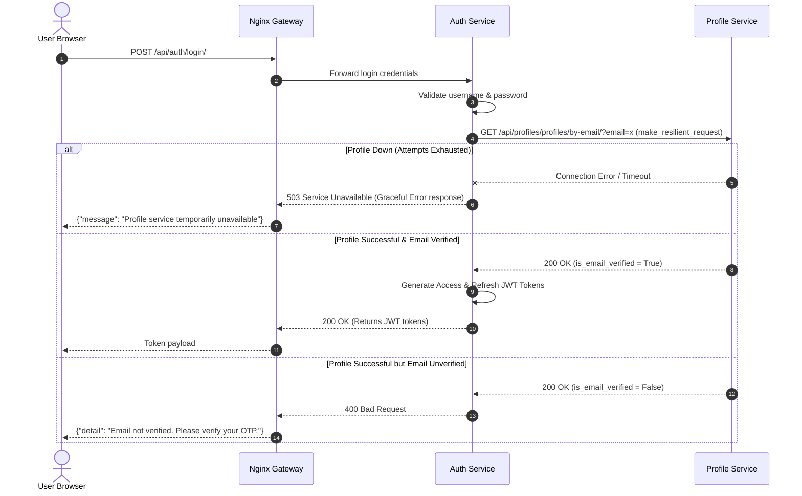
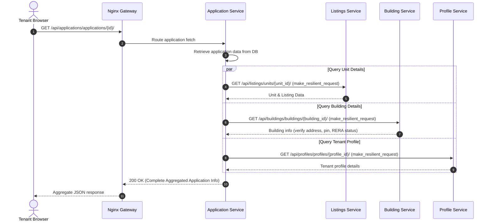

# HomeHaven — Django Microservices Rental Platform

[](https://www.python.org/)
[](https://www.djangoproject.com/)
[](https://www.docker.com/)
[](https://www.postgresql.org/)
[](https://redis.io/)
[](https://docs.celeryq.dev/)
[](https://nginx.org/)
[](https://tenacity.readthedocs.io/)
[](https://www.openapis.org/)
[](https://swagger.io/)
[](https://kafka.apache.org/)
[](https://github.com/vidhan13i/rental-mvc-proejct/actions)

HomeHaven is a crowdsourced tenant reviews, building ratings, and rental applications platform. It's built as a set of independent Django REST Framework microservices behind an Nginx API gateway, with a React frontend handling the UI. The goal was to learn how to properly decompose a monolith into services that can be deployed and scaled independently.

---

## System Architecture

The whole platform runs on a single Docker bridge network (`rental_network`). Services find each other by container name — no service registry needed since everything is on the same compose network. Nginx sits at the front and routes requests to the right service based on URL prefix.


### Why these technologies?

- **Django REST Framework** — I wanted something batteries-included where I wouldn't have to write auth middleware or request parsing from scratch. DRF's serializers, viewsets, and permission classes save a lot of boilerplate, and `drf-spectacular` auto-generates OpenAPI docs from the code.
- **PostgreSQL** — Standard choice for relational data. Each service gets its own logical database on a shared Postgres instance (in prod you'd split these out to separate servers).
- **Apache Kafka** — The services need to react to events without tight coupling. When someone submits an application, the notification service and chat service both need to know, but the application service shouldn't have to call them directly. Kafka handles that fan-out. We went with Confluent's Docker images (`cp-kafka:7.6.1`) after running into issues with Bitnami's `latest` tag missing `kafka-topics.sh` for healthchecks.
- **Redis** — Used for three different things: Celery broker (task queues), Django Channels layer (WebSocket pub/sub), and OTP storage with TTL. Each use case gets its own Redis DB number to avoid key collisions.
- **Celery** — Sending emails synchronously would block the request thread. Celery offloads that to a worker process. Same deal for any slow background work.
- **Nginx** — Acts as the API gateway. It handles routing, CORS, and serves as the single entry point so the frontend only needs to know about one host.
- **Tenacity** — When service A calls service B over HTTP, B might be temporarily down. Tenacity gives us retry with exponential backoff so transient failures don't immediately crash the whole flow. The alternative was writing retry loops by hand, which gets messy fast.

### Event-Driven Communication

- **Notification Service** consumes events from Kafka (`UserRegistered`, `ApplicationCreated`, `ApplicationApproved`, `ApplicationRejected`, `MessageSent`, `ReviewCreated`, `ListingCreated`) and dispatches WebSocket alerts and emails.
- **Chat Service** listens for `ApplicationApproved` events and auto-creates a conversation between the renter and agent so they can start messaging immediately.

### Services Overview

| # | Service | What it does |
|---|---------|-------------|
| 1 | **Nginx Gateway** | Single entry point, routes by URL prefix |
| 2 | **Auth Service** | Registration, JWT tokens (SimpleJWT), coordinates profile creation |
| 3 | **Profile Service** | User profiles, OTP email verification |
| 4 | **Celery Workers** | Background email dispatch for OTP codes |
| 5 | **Application Service** | Rental application lifecycle (create, approve, reject) |
| 6 | **Listings Service** | Properties, units, agents, images |
| 7 | **Building Service** | Buildings, amenities, RERA verification |
| 8 | **Reviews Service** | Crowdsourced property ratings and tenant feedback |
| 9 | **Chat Service** | Real-time messaging via Django Channels + WebSockets |
| 10 | **Notification Service** | Event-driven notifications (in-app, email, WebSocket push) |

---

## API Documentation (OpenAPI 3.0)

Every service has its own Swagger UI and ReDoc. Once the containers are running:

| Service | Swagger UI | ReDoc |
|---------|------------|-------|
| Auth Service | [http://localhost:8001/api/docs/](http://localhost:8001/api/docs/) | [http://localhost:8001/api/redoc/](http://localhost:8001/api/redoc/) |
| Profile Service | [http://localhost:8002/api/docs/](http://localhost:8002/api/docs/) | [http://localhost:8002/api/redoc/](http://localhost:8002/api/redoc/) |
| Listings Service | [http://localhost:8003/api/docs/](http://localhost:8003/api/docs/) | [http://localhost:8003/api/redoc/](http://localhost:8003/api/redoc/) |
| Building Service | [http://localhost:8004/api/docs/](http://localhost:8004/api/docs/) | [http://localhost:8004/api/redoc/](http://localhost:8004/api/redoc/) |
| Application Service| [http://localhost:8005/api/docs/](http://localhost:8005/api/docs/) | [http://localhost:8005/api/redoc/](http://localhost:8005/api/redoc/) |
| Reviews Service | [http://localhost:8006/api/docs/](http://localhost:8006/api/docs/) | [http://localhost:8006/api/redoc/](http://localhost:8006/api/redoc/) |
| Chat Service | [http://localhost:8007/api/docs/](http://localhost:8007/api/docs/) | [http://localhost:8007/api/redoc/](http://localhost:8007/api/redoc/) |
| Notification Service| [http://localhost:8008/api/docs/](http://localhost:8008/api/docs/) | [http://localhost:8008/api/redoc/](http://localhost:8008/api/redoc/) |

You'll need to pass `Bearer <JWT>` in the Swagger UI Authorize button for protected endpoints.

---

## Platform Workflows

These diagrams show the actual request flows through the system — useful for understanding how the services coordinate.

### User Registration & Profile Setup

When someone registers, the auth service creates the user locally, then calls the profile service to set up their profile. If the profile service is down, we roll back the user creation to avoid orphaned accounts. After that, an OTP is generated and emailed via Celery.


### OTP Verification

Before logging in, users must verify their email with the 6-digit code. There's a brute-force lockout after 5 failed attempts — since the code space is small (6 digits), we need to rate-limit guesses.


### Login & JWT Issuance

The auth service validates credentials with SimpleJWT, then checks with the profile service whether the email is verified before handing out tokens.



### Rental Application Flow

When fetching an application, the application service fans out to listings, building, and profile services in parallel to assemble the full picture.



---

## Getting Started

### Prerequisites
- Docker & Docker Compose installed.

### Setup
1. Clone the repo and `cd` into it:
   ```bash
   cd Rental_mvc_project
   ```

2. Create your `.env` from the template:
   ```bash
   cp .env.example .env
   ```
   Fill in `DB_PASSWORD`, `JWT_SECRET_KEY`, `EMAIL_HOST_PASSWORD`, and any other blanks.

3. Build and start everything:
   ```bash
   docker compose up -d --build
   ```

4. Access points:
   - **API Gateway**: `http://localhost:8000/`
   - **Frontend**: `http://localhost:5174/`
   - **Health Check**: `http://localhost:8000/health/`

---

## Security & Fault Tolerance Notes

These are changes made during development that are worth knowing about:

### Secrets handling
All secrets (JWT keys, DB passwords, SMTP creds) used to be hardcoded in settings files. They've been moved to environment variables loaded from `.env`. Each service validates on startup that its required secrets are present — if something's missing, Django raises `ImproperlyConfigured` and the container fails immediately rather than running in a broken state.

### OTP hashing
OTPs were originally hashed with plain SHA-256. The problem is that a 6-digit code has only a million possibilities, so SHA-256 hashes are trivially reversible with a lookup table. We switched to Django's `make_password`/`check_password` which uses PBKDF2 with a random salt. Combined with the 5-attempt lockout and automatic key deletion, this makes brute-forcing impractical.

### Inter-service resilience
When one service calls another over HTTP, there's always a chance the target is down or slow. Without timeouts, the calling thread just hangs forever. We added a shared resilience library (`shared_lib/resilience.py`) that wraps `requests` calls with Tenacity retry logic — exponential backoff, filtered retries (only on `ConnectionError`, `Timeout`, and 5xx responses), and strict timeout constraints. If retries are exhausted, the caller returns a clean `503` response instead of crashing.

---

## Known Issues & Fixes

Some bugs we hit during development that were tricky to debug:

### Agent couldn't see applications for their properties
The application queryset was filtering by `user == application.owner`, but agents aren't the "owner" of an application — the renter is. Fixed it to look up the agent's units from the listings service, then filter applications by those unit IDs.

### Profile IDs were out of sync
The profile service was ignoring the UUID sent from auth and generating its own. This meant `Auth.id != Profile.id`, which broke cross-service lookups. Fixed the serializer to accept and use the auth-provided UUID.

### Chat messages showing up upside down
The API was returning messages oldest-first, but the frontend was prepending them. Fixed the API to return `-created_at` ordering and adjusted the React flex layout.

### Double messages in chat
A race condition — the WebSocket broadcast was faster than the REST API response, so the frontend would add the message from the WebSocket, then add it again from the API callback. Added a duplicate ID check in the frontend's API handler.

### Users showing as offline when they were online
The WebSocket consumer was broadcasting `user_online` when someone connected, but it never told newly-connecting users about people already in the room. Fixed by querying Redis for the other participant's presence during the connection handshake.

---

## Performance (Benchmarked)

We benchmarked the system locally using Docker Compose. Full details in [PERFORMANCE_REPORT.md](PERFORMANCE_REPORT.md).

- **API Throughput**: Peaks at ~2,280 req/sec for cached endpoints, ~1,100 req/sec for complex DB joins.
- **WebSocket**: 0% failure rate at 250 concurrent users, 45ms average latency.
- **Kafka**: 14,000+ messages/sec producer throughput.
- **Docker**: Cold start ~105s, warm start ~15s.
