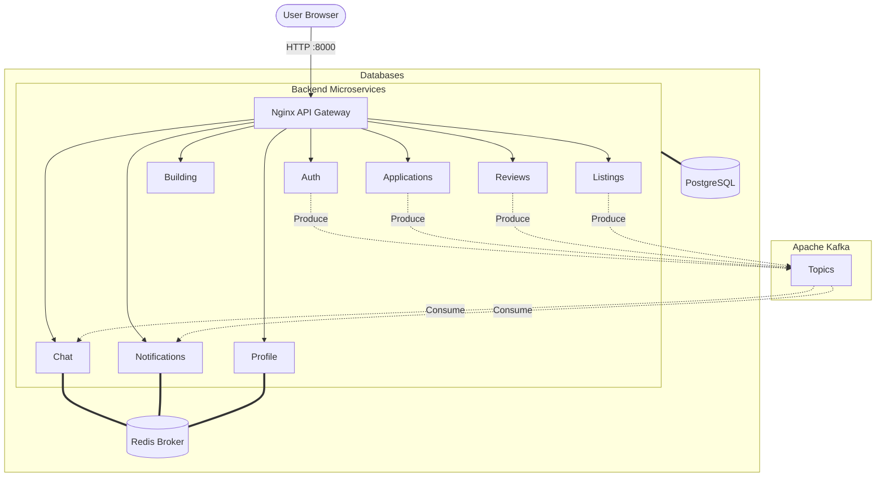
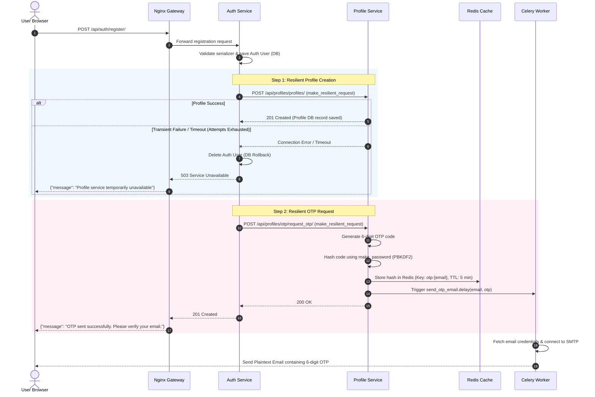
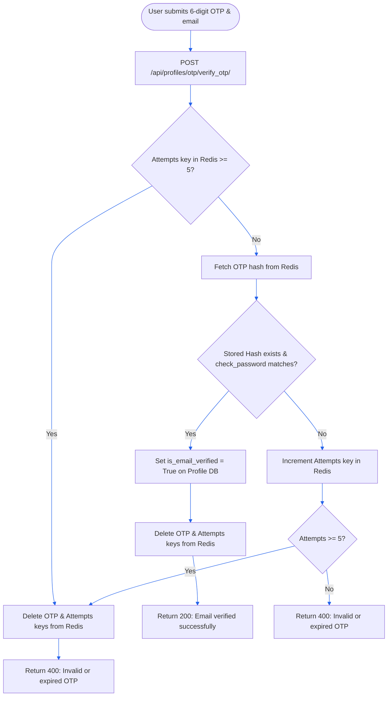
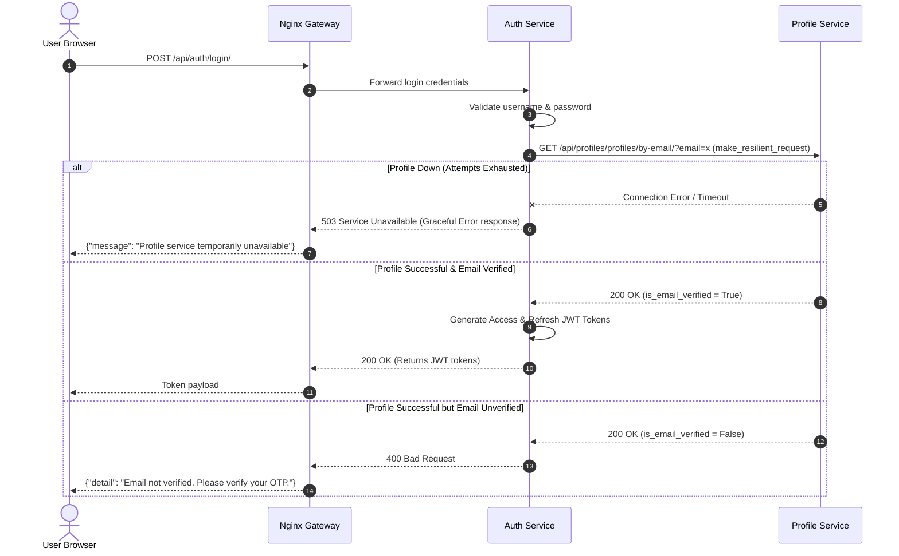
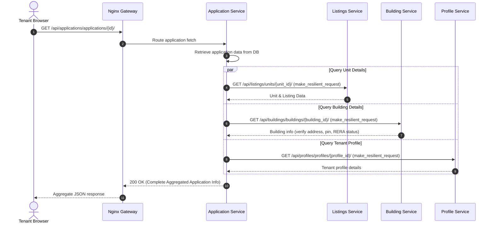

# HomeHaven — Django Microservices Rental Platform

[](https://www.python.org/)
[](https://www.djangoproject.com/)
[](https://www.docker.com/)
[](https://www.postgresql.org/)
[](https://redis.io/)
[](https://docs.celeryq.dev/)
[](https://nginx.org/)
[](https://tenacity.readthedocs.io/)
[](https://www.openapis.org/)
[](https://swagger.io/)
[](https://kafka.apache.org/)
[](https://github.com/vidhan13i/rental-mvc-proejct/actions)

HomeHaven is a premium crowdsourced tenant reviews, building ratings, and rental applications microservices platform. The system is built with a decoupled React frontend and a multi-container Django REST Framework backend routed through an Nginx API Gateway.

---

## 1. System Architecture

## 2. API Documentation (OpenAPI 3.0)

Every microservice exposes its own independent Swagger UI and ReDoc interface. You can access the interactive API documentation for each service on its dedicated port:

| Service | Swagger UI | ReDoc |
|---------|------------|-------|
| Auth Service | [http://localhost:8001/api/docs/](http://localhost:8001/api/docs/) | [http://localhost:8001/api/redoc/](http://localhost:8001/api/redoc/) |
| Profile Service | [http://localhost:8002/api/docs/](http://localhost:8002/api/docs/) | [http://localhost:8002/api/redoc/](http://localhost:8002/api/redoc/) |
| Listings Service | [http://localhost:8003/api/docs/](http://localhost:8003/api/docs/) | [http://localhost:8003/api/redoc/](http://localhost:8003/api/redoc/) |
| Building Service | [http://localhost:8004/api/docs/](http://localhost:8004/api/docs/) | [http://localhost:8004/api/redoc/](http://localhost:8004/api/redoc/) |
| Application Service| [http://localhost:8005/api/docs/](http://localhost:8005/api/docs/) | [http://localhost:8005/api/redoc/](http://localhost:8005/api/redoc/) |
| Reviews Service | [http://localhost:8006/api/docs/](http://localhost:8006/api/docs/) | [http://localhost:8006/api/redoc/](http://localhost:8006/api/redoc/) |
| Chat Service | [http://localhost:8007/api/docs/](http://localhost:8007/api/docs/) | [http://localhost:8007/api/redoc/](http://localhost:8007/api/redoc/) |
| Notification Service| [http://localhost:8008/api/docs/](http://localhost:8008/api/docs/) | [http://localhost:8008/api/redoc/](http://localhost:8008/api/redoc/) |

*Note: You must pass `Bearer <JWT>` in the Swagger UI Authorize button to test protected endpoints.*

The platform runs on a unified Docker bridge network (`rental_network`) where services discover each other statelessly by container name:



### Event-Driven Highlights (Kafka)
- **Notification Service**: Centralized service consuming `UserRegistered`, `ApplicationCreated`, `ApplicationApproved`, `ApplicationRejected`, `MessageSent`, `ReviewCreated`, and `ListingCreated` events to dispatch WebSockets and Emails.
- **Chat Service**: Consumes `ApplicationApproved` to auto-create a direct conversation between renter and agent.

### Troubleshooting Log
- **Kafka Docker Images**: Transitioned from `bitnami/kafka:latest` to `confluentinc/cp-kafka:7.6.1` and `confluentinc/cp-zookeeper:7.6.1` due to unresolved tag issues and missing `kafka-topics.sh` for healthchecks.
- **YAML Formatting**: Fixed YAML block array vs dict formatting in the Kafka environment block inside `docker-compose.yml`.
- **Healthchecks**: Addressed docker compose hanging on dependency wait by using `--no-deps` for `makemigrations` and adjusting compose wait mechanisms.

### Microservices Catalog
1. **Nginx Gateway**: The single entry point, routing requests dynamically to target internal services.
2. **Auth Service**: Handles user registration, JWT token generation, simplejwt authentication, and coordinates profile setups.
3. **Profile Service**: Manages detailed tenant profiles and coordinates OTP generation.
4. **Celery Worker**: Performs background email dispatches for OTP codes.
5. **Application Service**: Handles creation and approval flow of rental applications, documents, and applicant profiles.
6. **Listings Service**: Hosts rental listings, units, agent credentials, and property imagery.
7. **Building Service**: Aggregates buildings, amenities, and RERA property verifications.
8. **Reviews Service**: Aggregates crowdsourced property ratings and tenant feedback.

---

## 2. Platform Workflows & Flowcharts

The following diagrams illustrate the detailed working mechanics of the system during user onboarding, OTP verification, authentication, and rental submissions.

### A. User Registration & Profile Provisioning Flow
During registration, the `auth_service` coordinates with the `profile_service` to build user credentials and profile records. If profile creation fails due to network issues, the user creation is rolled back (deleted) to prevent orphaned login accounts.



### B. OTP Code Verification Flow
Before users can log in, they must verify their email by submitting the 6-digit code. To prevent brute-force attacks on the short code space, the system tracks attempts in Redis and locks the user out after 5 failures.



### C. Login & JWT Issuance Flow
When a user attempts to log in, the `auth_service` checks SimpleJWT credentials and makes a resilient request to the `profile_service` to check email verification status before issuing tokens.



### D. Rental Application Submission & Review Lookup
The platform allows applicants to apply for listings. The Application service coordinates building verification and reviews to build the context.



---

## 3. Platform Configuration & Running

### Prerequisites
* Docker & Docker Compose installed on your system.

### Running Internals
1. **Clone the Repository** and navigate to the project directory:
   ```bash
   cd Rental_mvc_project
   ```

2. **Configure Environment Variables**:
   Create a root `.env` file using the template provided:
   ```bash
   cp .env.example .env
   ```
   Provide values for critical variables (e.g., `DB_PASSWORD`, `JWT_SECRET_KEY`, `EMAIL_HOST_PASSWORD`, etc.).

3. **Build and Run the System**:
   Start all microservices and dependencies in the background:
   ```bash
   docker compose up -d --build
   ```

4. **Access the Services**:
   * **API Gateway**: `http://localhost:8000/`
   * **Frontend**: `http://localhost:5174/`
   * **Nginx Gateway Health**: `http://localhost:8000/health/`

---

## 4. Key Security & Fault Tolerance Upgrades

During our latest session, we executed a complete configuration refactor to align the microservices architecture with production-level security and resilience standards:

### 🛡️ Credential & Secrets Migration
* **Vulnerability**: JWT keys, database passwords, and SMTP secrets were hardcoded in code settings and compose files.
* **Resolution**: Migrated all secrets to environment variables (`os.environ.get`) loaded from the unified `.env`. Added strict startup validations using Django's `ImproperlyConfigured` exception to fail fast if required secrets are absent.

### 🔐 OTP Hash Security Upgrade (Salted PBKDF2)
* **Vulnerability**: OTP codes were previously hashed using standard, fast `SHA-256` which made them vulnerable to lookup/rainbow-table attacks on Redis memory dumps.
* **Resolution**: Replaced SHA-256 with Django's native `make_password` and `check_password` utility functions. This enforces salted **PBKDF2 hashing** on the 6-digit codes. Added brute-force tracking (lockout after 5 failed attempts) and immediate deletion of keys upon success/lockout.

### 🔗 Resilient Inter-Service REST Calls (Tenacity)
* **Vulnerability**: Direct, un-timeouted calls caused calling thread hangs when target services went offline, failing the entire registration flow.
* **Resolution**:
  * Established a centralized resilience library at `shared_lib/resilience.py` mounted as a volume across all microservice containers to eliminate code duplication.
  * Configured retry actions with **exponential backoff** (`multiplier=1`, `min=1`, `max=10`).
  * Filtered retries so they only trigger on transient failures (ConnectionError, Timeout, and HTTP `429`, `500`, `502`, `503`, and `504` status codes).
  * Added request duration tracking (`time.time() - start_time`) and custom stdout stream logs (e.g. `[INFO] resilience - Request to profile_service succeeded. Status: 201, Duration: 0.25s`).
  * Enforced fast timeout constraints (`timeout=2`, `max_attempts=2`) for authentication requests to prevent bad user experiences.
  * Designed explicit, graceful `503 Service Unavailable` JSON responses (`{"message": "<Service Name> temporarily unavailable"}`) upon connection failures.

---

## 5. Recent Issues & Resolutions

During the development and testing of complex microservice interactions, several critical bugs were identified and resolved:

### 1. Agent Application Visibility (Data Siloing)
* **Issue**: Agents logging into their dashboard were unable to see applications submitted by renters for their properties.
* **Root Cause**: The `application_service` was overriding the `get_queryset` strictly checking if the user was the "owner" of the application, rather than checking if the user was the agent of the unit the application was tied to.
* **Fix**: Rewrote the application query logic to execute a cross-service check to the `listings_service`, fetching all units owned by the agent, and filtering the application list to match those units.

### 2. Missing Profile IDs on Application Creation (Microservice Desync)
* **Issue**: Creating new rental applications failed because the `profile_id` was missing.
* **Root Cause**: The `auth_service` and `profile_service` UUIDs became desynchronized. The `profile_service` was ignoring the `auth_service` UUID during profile creation and generating its own random UUID.
* **Fix**: Updated the `ProfileCreateUpdateSerializer` to explicitly accept and enforce the Auth UUID. Re-synced existing user profiles to ensure `Auth.id == Profile.id`.

### 3. Chat UI Message Ordering (Upside-Down Messages)
* **Issue**: Messages in the chat window were appearing upside down and overlapping awkwardly.
* **Root Cause**: The `chat_service` REST API was returning messages chronologically oldest-first, and the frontend was appending them in reverse.
* **Fix**: Added explicit `-created_at` ordering to the backend API view to guarantee a consistent timeline, and updated the React `flex-col` logic to render them top-to-bottom.

### 4. Real-Time Chat Double Messages (Race Condition)
* **Issue**: When a user sent a message, it appeared on their screen twice instantly.
* **Root Cause**: A race condition where the ultra-fast Redis WebSocket `receive_message` broadcast beat the REST API `POST` success response. Both systems blindly appended the message to the React state.
* **Fix**: Implemented a duplicate ID check within the frontend's REST API promise handler to ensure a message is only appended if the WebSocket hasn't already rendered it.

### 5. Chat Offline Presence Bug (Initial State Sync)
* **Issue**: Users were appearing "Offline" even when they were actively staring at the chat screen.
* **Root Cause**: While the system correctly broadcasted a `user_online` event *when* someone connected, it failed to tell newly connected users the status of people who were *already* in the room.
* **Fix**: Updated the Django Channels `chat_consumer.py` to synchronously query Redis for the other participant's presence status during the initial connection handshake, passing `other_user_online` directly into the frontend's initial state.

---

## 🚀 Performance & Scalability (Benchmarked)
A comprehensive performance suite was engineered to benchmark the entire microservices architecture locally using Docker Compose. For the full dataset, see [PERFORMANCE_REPORT.md](PERFORMANCE_REPORT.md).

- **API Throughput (Apache Bench)**: The system handles highly concurrent REST requests efficiently, peaking at **2,282 requests/second** for cached application endpoints and sustaining **~1,100 req/sec** for complex database joins (Listings & Buildings). 
- **WebSocket Scalability (Locust)**: Django Channels, backed by Redis pub/sub, maintained **0% failure rates** and an average response latency of **45ms** while processing 3,210 requests from **250 concurrent users**.
- **Event-Driven Architecture (Kafka)**: Confluent Kafka pipelines easily exceeded a throughput of **14,000+ messages/sec**, ensuring that asynchronous processes (like profile generation and email notifications) never bottleneck the main HTTP request loop.
- **Docker Optimization**: The optimized Docker Compose architecture can cold-start the entire 8-service distributed system in **105 seconds**, with subsequent warm starts completing in just **15 seconds**.
